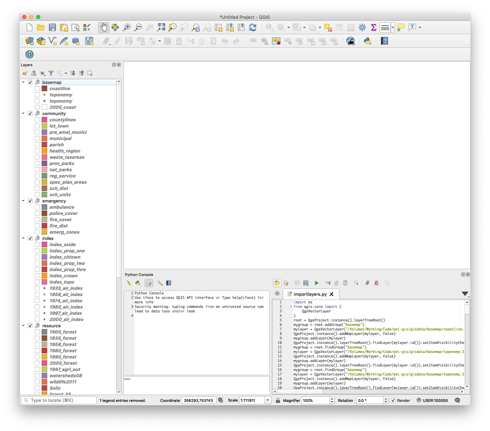

PEI GIS Grabber
===============

The Province of Prince Edward Island, Canada provides access to [GIS data via its website](http://www.gov.pe.ca/gis/index.php3?number=77543&lang=E).

This script allows you to easily download *all* of the GIS data available in a form suitable for loading into [QGIS](https://www.qgis.org/) for analysis and manipulation.

Requirements
------------

* PHP 5.x
* [PHP Simple HTML DOM Parser](http://simplehtmldom.sourceforge.net/)
* [wget](http://www.gnu.org/s/wget/)

Usage
-----

Edit the file scrape-gis.php and check and/or modify the **$downloadDir**, **$wget** and **$zip** variables as required.

You may also need to modify the *$gisPages* array if the "Free GIS Products" links on the [main GIS catalog page](http://www.gov.pe.ca/gis/index.php3?number=77543&lang=E) change or are expanded.

Once everything is in place:

    php scrape-gis.php

and the all of the SHP files linked to from the various free GIS data pages will be downloaded, aggregated into folders based on the page they were scraped from. You can modify the script if you want to get only MID/MIF or NTX files, or only files of a certain name.

Import into QGIS
----------------

Once all the data has been scraped, you will end up with a Python script called *importlayers.py* in your **$downloadDir**.

From within QGIS, open the Python Console (**Plugins > Python Console**), click on the *Show Editor* icon on the Python Console toolbar, and then the *Open Script* icon in the Editor, and open *importlayers.py* and click the *Run* icon.

The script will execute on paste, and the end result should be a QGIS project containing all of the PEI GIS layers:

Caution
-------

The implication of using the script to automatically download these files is presumably that you agree to the various [licensing agreements](http://www.gov.pe.ca/gis/index.php3?number=77462&lang=E) in place.

This code is not guaranteed to work properly, or at all, and I have no connection other than residency to the Province of Prince Edward Island.

Credits
-------

[Peter Rukavina](https://ruk.ca/)